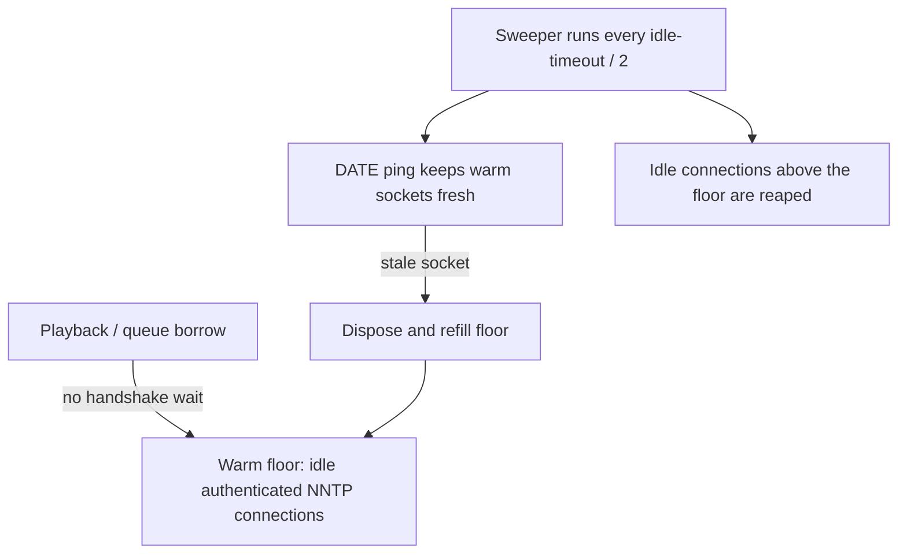

# Connection warming

Connection warming [since 1.2.0](https://github.com/infinidysk/infinidysk/releases/tag/v1.2.0){ .nzbdav-since } keeps a small number of pre-connected, authenticated NNTP sockets standing by on each pooled provider. Playback and queue work borrow one instantly instead of paying the TCP + TLS + login handshake first — which is most of the wait between pressing play and the first bytes moving after an idle period.

## How it works

Each pooled provider gets a **warm floor**: a target count of idle, ready-to-use connections. By default the floor is derived from the provider's **Max Connections** — roughly one sixth of it, at least 1 and at most 8.

- A background sweeper runs every half of the [idle connection timeout](../configuration/streaming.md) (default: every 30 seconds). It refills the floor when sockets were lost and reaps idle connections **only above the floor** — warm connections are never closed just for being idle.
- Before a provider's own idle timeout can drop a warm socket, the sweeper pings it with a lightweight NNTP `DATE` command. A failed ping means the socket went stale; it is disposed and the floor refills.
- Warm connections never hold download permits, so the full configured connection width stays available to real work.
- If a provider is unreachable at startup, warming does not spin or block startup — retries resume once the provider circuit permits new opens. When InfiniDysk learns that a provider's real connection limit is lower than configured, the floor shrinks with it.
- Pending warm-up work has a 15-second acquisition budget and stops when its provider circuit trips. Factories already opening keep their own socket-open deadline. Warm-up never claims the half-open recovery probe. A connection-open timeout pauses new sockets without discarding healthy established ones; see [provider acquisition waits](../configuration/streaming.md#provider-acquisition-waits).

## What you see in the header

The **Connections** indicator in the top navigation shows pooled-provider totals, updated live (about five times per second):

- `5/50` — live connections across pooled providers versus their combined maximum.
- `2 active · 3 warm` — connections currently transferring versus idle warm ones. The warm part only appears while at least one warm connection is standing by.
- Hovering explains: *"Warm connections are pre-connected to your Usenet providers so playback can start faster."*

Other states: a spinner with **Connecting** until the first update arrives, **Reconnecting** while the live UI connection recovers from a brief drop, and `—` / **No providers** when no Usenet provider is configured. The indicator is hidden on narrow screens. Backup-only providers are excluded from the totals.

**Settings → Usenet** shows the same live counts on each provider card.

## Tuning

| Setting | Config key | Default | Effect |
|---------|------------|---------|--------|
| Warm connections | `usenet.warm-connections.enabled` | on | Keep a small pool of pre-connected sockets per provider |
| Warm floor | `usenet.warm-connections.floor` | auto | Idle sockets kept ready per provider; auto derives one sixth of Max Connections, clamped to 1–8 |
| Read-start warm-up [since 1.3.0](https://github.com/infinidysk/infinidysk/releases/tag/v1.3.0){ .nzbdav-since } | `usenet.read-start-warmup.enabled` | on | For a long buffered read, open missing pooled-provider connections in parallel as the first segment starts |

There is no settings-UI toggle; set the keys as [headless environment variables](../configuration/headless.md) (`NZBDAV_CONFIG__USENET__WARM_CONNECTIONS__ENABLED` / `NZBDAV_CONFIG__USENET__WARM_CONNECTIONS__FLOOR`). Changes take effect on the next provider save or restart — connection pools are not rebuilt when these keys change alone.

Read-start warm-up is enabled by default. Each newly opened WebDAV stream
snapshots the value. Reads below
8 MiB, reads needing fewer than two connection batches, backup-only providers,
and providers with an open circuit are skipped. The target is bounded by the
stream's article window, download limit, provider connection limits, and any
per-provider transfer cap. Opened sockets return to the normal idle pool; the
warm floor still decides how many remain connected later. Set
`NZBDAV_CONFIG__USENET__READ_START_WARMUP__ENABLED=false` and restart to restore
demand-only expansion.

## Cost and trade-offs

- Warm sockets are real connections and count against the provider plan's connection limit, even while idle.
- Read-start warm-up can create up to three TCP/TLS/AUTHINFO sessions at once. Turn it off if a provider rejects legal connection bursts.
- Keepalive traffic is negligible: one tiny `DATE` exchange per warm socket per sweep.
- On very small plans or [memory-constrained hosts](../operations/memory-constrained-hosts.md), lower the floor or disable warming entirely.

[Usenet](../configuration/usenet.md) · [NNTP pipelining](nntp-pipelining.md) · [Streaming and seeking](streaming-seeking.md)
